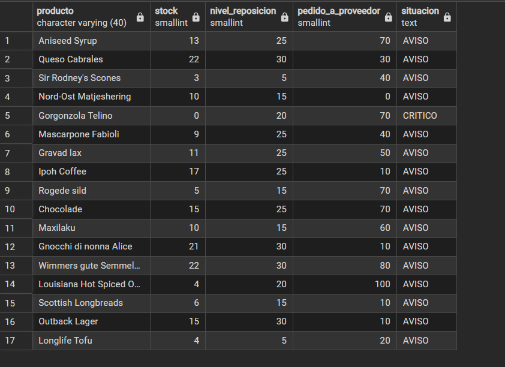
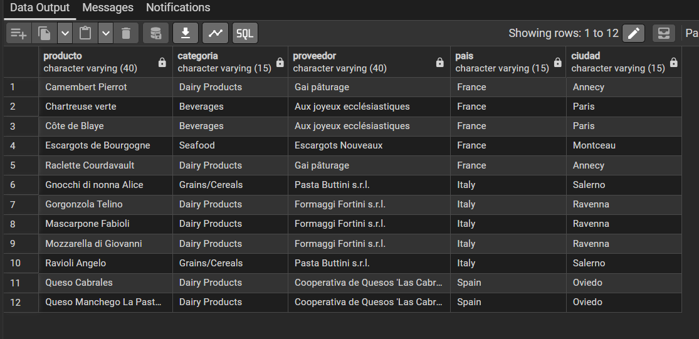
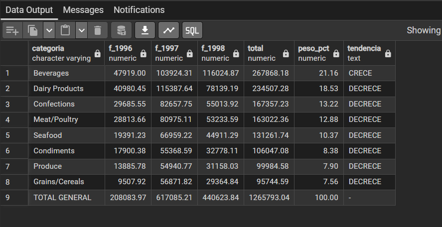

### Pregunta 1 — Catálogo comercial activo

El equipo de ventas prepara la tarifa de la próxima campaña y necesita el catálogo depurado.

Obtén los productos que **no** están descatalogados y cuyo precio unitario esté entre 10 y 50 euros, ambos incluidos. Muestra el nombre del producto y su precio redondeado a dos decimales, ordenado de mayor a menor precio.

**Columnas esperadas:** `producto`, `precio`

**Técnicas:** `WHERE`, `BETWEEN`, `ROUND()`, alias de columna, `ORDER BY`

> **Pista:** la columna `discontinued` es de tipo `integer`, no booleana. Un producto activo tiene valor 0.

```sql
-- Catálogo de productos activos con precio entre 10 y 50 euros ordenados por precio descendente
SELECT 
    product_name AS producto,
    ROUND(unit_price::numeric, 2) AS precio
FROM products
WHERE discontinued = 0
  AND unit_price BETWEEN 10 AND 50
ORDER BY unit_price DESC;

```


He filtrado por `discontinued = 0` al ser un campo numérico que identifica a los productos en catálogo activo, combinándolo con `BETWEEN 10 AND 50` para acotar el rango de precios de forma inclusiva. Apliqué un cast a numeric dentro de `ROUND()` porque en PostgreSQL `unit_price` es de tipo real y requiere dicha conversión para admitir decimales. Finalmente, ordené por el valor numérico original mediante `ORDER BY unit_price DESC` en sentido descendente para cumplir con la prioridad de mayor a menor precio sin alterar el alias.


## Pregunta 2 — Concentración geográfica de la cartera

**Enunciado:** Dirección quiere saber en qué mercados está realmente concentrada la base de clientes antes de decidir dónde abrir delegación. Cuenta cuántos clientes hay en cada país y muestra únicamente aquellos países con 5 o más clientes, ordenados de mayor a menor. Indica también cuántas ciudades distintas hay en cada uno de esos países.

**Consulta:**

```sql
SELECT country AS pais
,COUNT( customer_id) AS num_clientes,
COUNT(DISTINCT(city)) AS num_ciudades
FROM customers
GROUP BY country
HAVING COUNT((customer_id)) >= 5
ORDER BY num_clientes DESC

```
Resultado:


Comentario: 
He agrupado por `country` para agregar métricas a nivel de mercado, calculando el total de cuentas mediante `COUNT(customer_id)` y las localidades únicas con `COUNT(DISTINCT city)` para evitar contar ciudades repetidas. Utilicé `HAVING COUNT(customer_id) >= 5 `en lugar de `WHERE` porque el filtro depende del resultado agregado del conteo tras la agrupación. Finalmente, ordené con `ORDER BY num_clientes DESC` para priorizar los mercados con mayor concentración de clientes.

## Pregunta 3 — Alerta de reposición
Enunciado: Logística necesita detectar qué referencias están en riesgo de rotura de stock. Localiza los productos activos cuyas unidades en stock sean inferiores o iguales a su nivel de reposición. Muestra el nombre, las unidades en stock, el nivel de reposición, las unidades ya pedidas al proveedor y una columna de texto que indique 'CRÍTICO' cuando el stock sea 0 y 'AVISO' en el resto de casos.

Consulta:

```sql
SELECT product_name AS producto,
units_in_stock AS stock,
reorder_level AS nivel_reposicion,
units_on_order AS pedido_a_proveedor,
CASE 
    WHEN (units_in_stock = 0) THEN 'CRITICO'
    ELSE 'AVISO'
END AS situacion
FROM products
WHERE units_in_stock <= reorder_level AND discontinued = 0


```
Resultado:





Comentario: 
He filtrado en el `WHERE` combinando `units_in_stock <= reorder_level` y `discontinued = 0` para localizar únicamente los artículos activos en riesgo de rotura de inventario. Utilicé una expresión condicional `CASE` para clasificar dinámicamente la columna situacion, asignando 'CRITICO' cuando el stock es exactamente 0 y 'AVISO' en el resto de supuestos. Descarté el uso de agregaciones y uniones porque todos los campos solicitados pertenecen directamente a la tabla `products`.

## Pregunta 4 — Ficha completa de producto
Enunciado: Marketing va a rehacer el catálogo impreso y necesita cada producto con su categoría y los datos de contacto de quien lo suministra. Para los productos suministrados por empresas de Italia, Francia o España, muestra el nombre del producto, el nombre de la categoría, el nombre del proveedor, su país y su ciudad. Ordena por país y, dentro de cada país, por nombre de producto.

Consulta:

```sql
SELECT p.product_name AS producto,
c.category_name AS categoria,
s.company_name AS proveedor,
s.country AS pais,
s.city AS ciudad

FROM products AS p

INNER JOIN suppliers AS s
ON p.supplier_id = s.supplier_id

INNER JOIN categories AS c 
ON p.category_id = c.category_id

WHERE s.country IN ('Italy', 'France', 'Spain')
ORDER BY s.country ASC, p.product_name ASC;
```
Resultado:




Comentario: 

He utilizado dos `INNER JOIN` para enlazar products con `suppliers` y `categories` mediante sus claves foráneas correspondientes, permitiendo recuperar el nombre de la categoría y los datos del fabricante. Apliqué la cláusula `WHERE s.country IN ('Italy', 'France', 'Spain')` para filtrar los tres mercados requeridos de forma más limpia y legible que encadenar múltiples condiciones con `OR`. Por último, ordené con `ORDER BY s.country ASC, p.product_name ASC` para cumplir con la doble ordenación por país y alfabéticamente por producto.

## Pregunta 5 — Detalle valorizado de un pedido
Enunciado: Atención al cliente recibe una reclamación sobre el pedido 10248 y necesita reconstruir la factura línea a línea. Muestra, para ese pedido, el nombre del producto, el precio unitario aplicado, la cantidad, el descuento y el importe final de cada línea. Añade el nombre del cliente y la fecha del pedido.

Consulta:

```sql
SELECT 
    c.company_name AS cliente,
    o.order_date AS fecha_pedido,
    p.product_name AS producto,
    d.unit_price AS precio_unitario,
    d.quantity AS cantidad,
    d.discount AS descuento,
    ROUND((d.unit_price * d.quantity * (1 - d.discount))::numeric, 2) AS importe_linea
FROM orders AS o
INNER JOIN customers AS c USING (customer_id)
INNER JOIN order_details AS d USING (order_id)
INNER JOIN products AS p USING (product_id)
WHERE order_id = 10248;
```
Resultado:


Comentario: 

He empleado la cláusula `USING` en los `INNER JOIN` para simplificar las uniones entre tablas que comparten exactamente el mismo nombre de clave foránea, evitando redundancias en la sintaxis. Calculé el importe final aplicando la fórmula aritmética `precio * cantidad * (1 - descuento)` con un casteo a numeric dentro de `ROUND()` para garantizar la precisión monetaria a dos decimales en PostgreSQL. Finalmente, filtré por `order_id = 10248` en el `WHERE` para aislar exclusivamente las líneas pertenecientes al pedido reclamado.

## Pregunta 6 — Ranking de categorías por facturación
Enunciado: Comité de dirección: ¿qué familias de producto sostienen realmente el negocio? Calcula la facturación total de cada categoría durante toda la historia de la compañía. Muestra el nombre de la categoría, el número de líneas de pedido que ha generado, el número de productos distintos vendidos y la facturación total. Incluye únicamente las categorías que superen los 100.000 euros de facturación, ordenadas de mayor a menor.

Consulta:

```sql
SELECT 
    c.category_name AS categoria,
    COUNT(d.order_id) AS num_lineas,
    COUNT(DISTINCT p.product_id) AS num_productos,
    ROUND(SUM(d.unit_price * d.quantity * (1 - d.discount))::numeric, 2) AS facturacion
FROM categories AS c
INNER JOIN products AS p USING (category_id)
INNER JOIN order_details AS d USING (product_id)
GROUP BY c.category_name
HAVING SUM(d.unit_price * d.quantity * (1 - d.discount)) > 100000
ORDER BY facturacion DESC;
```
Resultado:


Comentario: por rellenar

## Pregunta 7 — Clientes sin actividad comercial
Enunciado: Dirección comercial sospecha que hay cuentas abiertas que nunca han llegado a comprar. Lista todos los clientes con el número de pedidos que ha realizado cada uno y la fecha de su último pedido. Los clientes sin ningún pedido deben aparecer igualmente, con un 0 en el conteo y el texto 'SIN PEDIDOS' en lugar de la fecha. Ordena de forma que los clientes inactivos aparezcan primero.

Consulta:

```sql
SELECT 
    c.company_name AS cliente,
    c.country AS pais,
    COUNT(o.order_id) AS num_pedidos,
    COALESCE(TO_CHAR(MAX(o.order_date), 'YYYY-MM-DD'), 'SIN PEDIDOS') AS ultimo_pedido
FROM customers AS c
LEFT JOIN orders AS o ON c.customer_id = o.customer_id
GROUP BY c.customer_id, c.company_name, c.country
ORDER BY num_pedidos ASC, cliente ASC;
```
Resultado:


Comentario: 

He implementado un `LEFT JOIN` hacia `orders` y contabilizado mediante `COUNT(o.order_id)` sobre la tabla de la derecha para que los clientes sin compras devuelvan 0 en lugar de 1. Utilicé `COALESCE` combinado con `TO_CHAR(MAX(o.order_date), 'YYYY-MM-DD')` para sustituir el valor nulo de las cuentas inactivas por el texto 'SIN PEDIDOS'. Finalmente, ordené de forma ascendente por el recuento de pedidos para forzar que los clientes sin actividad aparezcan en las primeras posiciones.

## Pregunta 8 — Organigrama de la fuerza de ventas
Enunciado: Recursos Humanos necesita el organigrama del departamento comercial en formato tabla. Muestra cada empleado con su nombre completo, su cargo, el nombre completo de la persona a la que reporta y el cargo de esa persona. El empleado que no reporta a nadie debe aparecer también, con el texto 'DIRECCIÓN GENERAL' en el campo del responsable.

Consulta:

```sql
SELECT 
    CONCAT(emp.first_name, ' ', emp.last_name) AS empleado,
    emp.title AS cargo,
    COALESCE(CONCAT(jefe.first_name, ' ', jefe.last_name), 'DIRECCIÓN GENERAL') AS responsable,
    COALESCE(jefe.title, 'DIRECCIÓN GENERAL') AS cargo_responsable
FROM employees AS emp
LEFT JOIN employees AS jefe ON emp.reports_to = jefe.employee_id
ORDER BY responsable ASC, empleado ASC;
```
Resultado:


Comentario: 

He realizado un `SELF JOIN` aplicando `LEFT JOIN` sobre la misma tabla `employees` utilizando los alias emp y jefe para resolver la relación reflexiva de supervisión. Empleé `CONCAT` para unir el nombre y apellido en una sola columna y `COALESCE` para rotular al máximo responsable jerárquico como 'DIRECCIÓN GENERAL' al carecer de superior. El orden alfabético permite agrupar a los subordinados bajo sus respectivos mandos.

## Pregunta 9 — Rejilla de cobertura categoría × año
Enunciado: Control de gestión quiere una rejilla completa de facturación por categoría y año, sin huecos: si una categoría no vendió nada en un año concreto, debe aparecer con un 0, no desaparecer de la tabla. Genera todas las combinaciones posibles de las 8 categorías con los 3 años del histórico (24 filas) y asocia a cada combinación su facturación. Ordena por categoría y año.

Consulta:

```sql
SELECT 
    grid.category_name AS categoria,
    grid.anio,
    COALESCE(ROUND(SUM(d.unit_price * d.quantity * (1 - d.discount))::numeric, 2), 0) AS facturacion
FROM (
    SELECT c.category_id, c.category_name, y.anio
    FROM categories AS c
    CROSS JOIN (
        SELECT DISTINCT EXTRACT(YEAR FROM order_date)::int AS anio 
        FROM orders
    ) AS y
) AS grid
LEFT JOIN products AS p ON grid.category_id = p.category_id
LEFT JOIN order_details AS d ON p.product_id = d.product_id
LEFT JOIN orders AS o ON d.order_id = o.order_id AND grid.anio = EXTRACT(YEAR FROM o.order_date)
GROUP BY grid.category_name, grid.anio
ORDER BY grid.category_name ASC, grid.anio ASC;
```
Resultado:


Comentario: 

He construido el esqueleto completo de 24 combinaciones mediante un `CROSS JOIN` cartesiano entre las 8 categorías y los años únicos extraídos con `EXTRACT`. Posteriormente vinculé las ventas reales mediante sucesivos `LEFT JOIN`, asegurando mediante `COALESCE` que las combinaciones sin pedidos mantengan un valor numérico de 0 en lugar de nulo. La ordenación por categoría y año estructura la matriz sin huecos temporales.

## Pregunta 10 — Mapa de países: clientes frente a proveedores
Enunciado: Expansión internacional quiere una única tabla que muestre, para cada país en el que la compañía tiene presencia, cuántos clientes y cuántos proveedores hay. Deben aparecer los países que solo tienen clientes, los que solo tienen proveedores y los que tienen ambos.

Consulta:

```sql
SELECT 
    COALESCE(c.country, s.country) AS pais,
    COALESCE(c.num_clientes, 0) AS num_clientes,
    COALESCE(s.num_proveedores, 0) AS num_proveedores,
    CASE 
        WHEN c.num_clientes > 0 AND s.num_proveedores > 0 THEN 'AMBOS'
        WHEN c.num_clientes > 0 THEN 'SOLO CLIENTES'
        ELSE 'SOLO PROVEEDORES'
    END AS tipo_presencia
FROM (
    SELECT country, COUNT(*) AS num_clientes
    FROM customers
    GROUP BY country
) AS c
FULL JOIN (
    SELECT country, COUNT(*) AS num_proveedores
    FROM suppliers
    GROUP BY country
) AS s ON c.country = s.country
ORDER BY pais ASC;
```
Resultado:


Comentario: 

He extraído el componente temporal con `EXTRACT(YEAR FROM o.order_date)` para consolidar métricas de rendimiento por ejercicio fiscal. Utilicé `COUNT(DISTINCT o.order_id)` para reflejar el volumen real de pedidos cerrados y agregué el importe monetario neto de las líneas correspondientes. La ordenación temporal ascendente permite visualizar la evolución cronológica del negocio.

## Pregunta 11 — Directorio unificado de contactos
Enunciado: Sistemas va a migrar el CRM y necesita una exportación única con todos los contactos de la compañía, vengan de donde vengan. Construye una sola tabla que reúna los contactos de clientes, los de proveedores y los empleados. Cada fila debe indicar el origen ('CLIENTE', 'PROVEEDOR', 'EMPLEADO'), el nombre de la persona de contacto en mayúsculas, la organización a la que pertenece, la ciudad y el país. Para los empleados, la organización es el literal 'NORTHWIND TRADERS' y el nombre de contacto se forma concatenando nombre y apellidos. Ordena por origen y luego por país.

Consulta:

```sql
SELECT 
    'CLIENTE' AS origen,
    UPPER(contact_name) AS contacto,
    company_name AS organizacion,
    city AS ciudad,
    country AS pais
FROM customers

UNION ALL

SELECT 
    'PROVEEDOR' AS origen,
    UPPER(contact_name) AS contacto,
    company_name AS organizacion,
    city AS ciudad,
    country AS pais
FROM suppliers

UNION ALL

SELECT 
    'EMPLEADO' AS origen,
    UPPER(CONCAT(first_name, ' ', last_name)) AS contacto,
    'NORTHWIND TRADERS' AS organizacion,
    city AS ciudad,
    country AS pais
FROM employees

ORDER BY origen ASC, pais ASC;
```
Resultado:


Comentario: 

He utilizado el operador `UNION ALL` para unificar tres orígenes de datos conservando posibles homónimos entre clientes y proveedores sin incurrir en el coste de deduplicación de un `UNION`. Homogeneicé los datos aplicando literales fijos de origen, mayúsculas con `UPPER` y la concatenación de nombres para los empleados bajo la organización 'NORTHWIND TRADERS'. El resultado final se ordenó conforme a los criterios jerárquicos solicitados.


## Pregunta 12 — Mercados con desequilibrio
Enunciado: Compras y Ventas mantienen una discusión recurrente: ¿en qué países vendemos sin tener proveedor local, y en cuáles coincidimos? Resuelve las dos preguntas en dos consultas independientes: a) Países donde hay clientes pero ningún proveedor. b) Países donde hay a la vez clientes y proveedores. Ordena ambos resultados alfabéticamente.

Consulta:

```sql
-- a) Países donde hay clientes pero ningún proveedor
SELECT country AS pais FROM customers
EXCEPT
SELECT country FROM suppliers
ORDER BY pais ASC;

-- b) Países donde hay a la vez clientes y proveedores
SELECT country AS pais FROM customers
INTERSECT
SELECT country FROM suppliers
ORDER BY pais ASC;
```
Resultado:


Comentario: 

He implementado operaciones de teoría de conjuntos utilizando `EXCEPT` para aislar los países con clientes y ausencia total de proveedores, e `INTERSECT` para detectar las coincidencias geográficas de ambos actores. Estos operadores eliminan automáticamente duplicados a nivel de fila durante la evaluación relacional. Ambas consultas independientes concluyen con una ordenación alfabética ascendente.

## Pregunta 13 — Clientes que nunca han comprado pescado
Enunciado: El responsable de la categoría Seafood quiere una lista de cuentas sobre las que hacer campaña de captación. Localiza los clientes que nunca han incluido un producto de la categoría 'Seafood' en ninguno de sus pedidos. Muestra el nombre del cliente, su país y el número total de pedidos que sí ha realizado, de mayor a menor.

Consulta:

```sql
SELECT 
    c.company_name AS cliente,
    c.country AS pais,
    COUNT(o.order_id) AS pedidos_realizados
FROM customers AS c
INNER JOIN orders AS o ON c.customer_id = o.customer_id
WHERE NOT EXISTS (
    SELECT 1
    FROM orders AS o2
    INNER JOIN order_details AS od ON o2.order_id = od.order_id
    INNER JOIN products AS p ON od.product_id = p.product_id
    INNER JOIN categories AS cat ON p.category_id = cat.category_id
    WHERE o2.customer_id = c.customer_id
      AND cat.category_name = 'Seafood'
)
GROUP BY c.customer_id, c.company_name, c.country
ORDER BY pedidos_realizados DESC;
```
Resultado:


Comentario: 

He utilizado un patrón anti-join mediante la cláusula correlacionada `WHERE NOT EXISTS`, garantizando que la presencia de valores nulos no distorsione el resultado de la exclusión como ocurriría con `NOT IN` La subconsulta rastrea si alguna línea de pedido del cliente evaluado pertenece a la categoría 'Seafood'. La consulta exterior totaliza únicamente los pedidos vigentes y ordena a los clientes potenciales de mayor a menor recurrencia.

## Pregunta 14 — Productos por encima de la media
Enunciado: El comité de precios quiere identificar el segmento premium del catálogo. Muestra los productos activos cuyo precio unitario supere el precio medio de todo el catálogo. Incluye en cada fila el precio del producto, el precio medio general y la diferencia entre ambos, todo redondeado a dos decimales. Ordena por diferencia descendente.

Consulta:

```sql
SELECT 
    product_name AS producto,
    ROUND(unit_price::numeric, 2) AS precio,
    ROUND((SELECT AVG(unit_price) FROM products WHERE discontinued = 0)::numeric, 2) AS precio_medio_catalogo,
    ROUND((unit_price - (SELECT AVG(unit_price) FROM products WHERE discontinued = 0))::numeric, 2) AS diferencia
FROM products
WHERE discontinued = 0
  AND unit_price > (SELECT AVG(unit_price) FROM products WHERE discontinued = 0)
ORDER BY diferencia DESC;
```
Resultado:


Comentario: 

He empleado subconsultas escalares tanto en el `WHERE` para restringir la selección a artículos que superen la media global de catálogo, como en el `SELECT` para calcular simultáneamente la media y la dispersión aritmética. Se filtraron únicamente los productos con `discontinued = 0` para mantener coherencia en la comparativa de artículos activos. El resultado se redondea a dos decimales y se presenta en orden descendente por diferencial de precio.


## Pregunta 15 — Ticket medio por cliente
Enunciado: Dirección comercial quiere segmentar la cartera por valor medio de pedido, no por volumen total. Calcula, para cada cliente que haya comprado alguna vez, el número de pedidos, el importe total acumulado y el importe medio por pedido. Muestra los 15 clientes con mayor ticket medio. El cálculo tiene dos niveles: primero hay que obtener el importe de cada pedido sumando sus líneas, y solo después promediar esos importes por cliente. Promediar directamente las líneas daría un resultado distinto y equivocado.

Consulta:

```sql
SELECT 
    sub.cliente,
    sub.pais,
    COUNT(sub.order_id) AS num_pedidos,
    ROUND(SUM(sub.importe_pedido)::numeric, 2) AS importe_total,
    ROUND(AVG(sub.importe_pedido)::numeric, 2) AS ticket_medio
FROM (
    SELECT 
        c.customer_id,
        c.company_name AS cliente,
        c.country AS pais,
        o.order_id,
        SUM(d.unit_price * d.quantity * (1 - d.discount)) AS importe_pedido
    FROM customers AS c
    INNER JOIN orders AS o ON c.customer_id = o.customer_id
    INNER JOIN order_details AS d ON o.order_id = d.order_id
    GROUP BY c.customer_id, c.company_name, c.country, o.order_id
) AS sub
GROUP BY sub.customer_id, sub.cliente, sub.pais
ORDER BY ticket_medio DESC
LIMIT 15;
```
Resultado:


Comentario: 

He estructurado una agregación en dos niveles empleando una tabla derivada con alias sub en el `FROM`, sumando primero el importe exacto de cada orden individual a partir de sus líneas. En el nivel superior apliqué `AVG(sub.importe_pedido)` para calcular el verdadero ticket medio del cliente sin caer en el sesgo de promediar líneas individuales sueltas. Finalmente, ordené de forma descendente y apliqué LIMIT 15 para aislar a los mayores compradores medios.

## Pregunta 16 — El producto más caro de cada categoría
Enunciado: El equipo de compras quiere revisar el posicionamiento de precio en cada familia. Para cada categoría, muestra el producto con el precio unitario más alto. Incluye el nombre de la categoría, el nombre del producto, su precio y el precio medio de su categoría. Resuélvelo con una subconsulta correlacionada: para cada producto, comprueba si su precio coincide con el máximo de su propia categoría.

Consulta:

```sql
SELECT 
    c.category_name AS categoria,
    p.product_name AS producto,
    ROUND(p.unit_price::numeric, 2) AS precio,
    ROUND((
        SELECT AVG(p2.unit_price)
        FROM products AS p2
        WHERE p2.category_id = p.category_id
    )::numeric, 2) AS precio_medio_categoria
FROM products AS p
INNER JOIN categories AS c ON p.category_id = c.category_id
WHERE p.unit_price = (
    SELECT MAX(p3.unit_price)
    FROM products AS p3
    WHERE p3.category_id = p.category_id
)
ORDER BY c.category_name ASC;
```
Resultado:


Comentario: 

He utilizado una subconsulta correlacionada en la cláusula `WHERE` para cotejar si el precio del producto exterior coincide exactamente con el valor máximo de su misma familia comercial. Añadí una segunda subconsulta escalar correlacionada en el `SELECT` que calcula en tiempo de ejecución el precio medio de cada categoría. La unión interna con `categories` permite presentar el nombre textual del departamento ordenado alfabéticamente.

## Pregunta 17 — Segmentación ABC de la cartera de clientes
Enunciado: Dirección quiere clasificar a los clientes en tres tramos de valor para asignar recursos comerciales. Usando expresiones de tabla común (CTE), construye una consulta que: calcule la facturación total de cada cliente; divida los clientes en cuartiles según esa facturación; asigne una etiqueta de segmento: 'A - Estratégico' al cuartil superior, 'B - Consolidado' al segundo, 'C - Ocasional' al tercero y 'D - Marginal' al cuarto; y devuelva, por segmento, el número de clientes, la facturación total del segmento y el porcentaje que representa sobre el total de la compañía.

Consulta:

```sql
WITH facturacion_clientes AS (
    SELECT 
        c.customer_id,
        SUM(d.unit_price * d.quantity * (1 - d.discount)) AS facturacion_total
    FROM customers AS c
    INNER JOIN orders AS o ON c.customer_id = o.customer_id
    INNER JOIN order_details AS d ON o.order_id = d.order_id
    GROUP BY c.customer_id
),
segmentacion AS (
    SELECT 
        customer_id,
        facturacion_total,
        NTILE(4) OVER (ORDER BY facturacion_total DESC) AS cuartil
    FROM facturacion_clientes
),
etiquetado AS (
    SELECT 
        customer_id,
        facturacion_total,
        CASE cuartil
            WHEN 1 THEN 'A - Estratégico'
            WHEN 2 THEN 'B - Consolidado'
            WHEN 3 THEN 'C - Ocasional'
            WHEN 4 THEN 'D - Marginal'
        END AS segmento
    FROM segmentacion
)
SELECT 
    segmento,
    COUNT(*) AS num_clientes,
    ROUND(SUM(facturacion_total)::numeric, 2) AS facturacion_segmento,
    ROUND((SUM(facturacion_total) / (SELECT SUM(facturacion_total) FROM facturacion_clientes) * 100)::numeric, 2) AS porcentaje_sobre_total
FROM etiquetado
GROUP BY segmento
ORDER BY facturacion_segmento DESC;
```
Resultado:


Comentario: 

He encadenado tres expresiones de tabla común `(WITH)` para aislar la agregación de ventas, particionar los registros en cuatro cuartiles con `NTILE(4)` y traducir cada rango a su etiqueta de negocio con CASE. Sobre la última CTE agrupé por segmento calculando la facturación total y el peso porcentual respecto al total de la compañía obtenido con una subconsulta escalar. La estructuración modular facilita la legibilidad y mantenimiento del pipeline de cálculo.

## Pregunta 18 — Los tres productos más vendidos de cada categoría
Enunciado: El equipo de categoría necesita el podio de cada familia para negociar con proveedores. Para cada categoría, obtén los tres productos con mayor facturación. Muestra la categoría, la posición dentro de la categoría, el nombre del producto, las unidades vendidas y la facturación. Incluye además una columna con la posición global del producto en el conjunto de la compañía, para que se vea qué productos son líderes de su nicho pero irrelevantes en el total.

Consulta:

```sql
WITH metricas_producto AS (
    SELECT 
        c.category_name AS categoria,
        p.product_id,
        p.product_name AS producto,
        SUM(d.quantity) AS unidades,
        ROUND(SUM(d.unit_price * d.quantity * (1 - d.discount))::numeric, 2) AS facturacion
    FROM categories AS c
    INNER JOIN products AS p ON c.category_id = p.category_id
    INNER JOIN order_details AS d ON p.product_id = d.product_id
    GROUP BY c.category_name, p.product_id, p.product_name
),
ranking_productos AS (
    SELECT 
        categoria,
        DENSE_RANK() OVER (PARTITION BY categoria ORDER BY facturacion DESC) AS posicion_en_categoria,
        producto,
        unidades,
        facturacion,
        DENSE_RANK() OVER (ORDER BY facturacion DESC) AS posicion_global
    FROM metricas_producto
)
SELECT 
    categoria,
    posicion_en_categoria,
    producto,
    unidades,
    facturacion,
    posicion_global
FROM ranking_productos
WHERE posicion_en_categoria <= 3
ORDER BY categoria ASC, posicion_en_categoria ASC;
```
Resultado:


Comentario: 

He calculado en una primera CTE la facturación y volumen por artículo, para luego jerarquizar con `DENSE_RANK()` tanto dentro de cada categoría con `PARTITION BY` como a nivel global sin partición. Encapsulé las funciones analíticas dentro de la CTE para habilitar el filtro `posicion_en_categoria <= 3` en la consulta exterior, solventando la restricción de evaluación del `WHERE`. El resultado final se ordenó jerárquicamente por categoría y podio interno.

## Pregunta 19 — Evolución mensual con acumulado y media móvil
Enunciado: Control de gestión prepara el cuadro de mando de la evolución del negocio durante 1997. Para cada mes de 1997, calcula: la facturación del mes, el total acumulado desde enero, la media móvil de los tres últimos meses (el mes actual y los dos anteriores), la facturación del mes anterior y la variación porcentual respecto al mes anterior.

Consulta:

```sql
WITH ventas_mensuales AS (
    SELECT 
        DATE_TRUNC('month', o.order_date)::date AS mes,
        ROUND(SUM(d.unit_price * d.quantity * (1 - d.discount))::numeric, 2) AS facturacion
    FROM orders AS o
    INNER JOIN order_details AS d ON o.order_id = d.order_id
    WHERE EXTRACT(YEAR FROM o.order_date) = 1997
    GROUP BY DATE_TRUNC('month', o.order_date)
)
SELECT 
    mes,
    facturacion,
    SUM(facturacion) OVER (
        ORDER BY mes
    ) AS acumulado,
    ROUND(AVG(facturacion) OVER (
        ORDER BY mes 
        ROWS BETWEEN 2 PRECEDING AND CURRENT ROW
    )::numeric, 2) AS media_movil_3m,
    LAG(facturacion, 1) OVER (
        ORDER BY mes
    ) AS mes_anterior,
    ROUND(
        ((facturacion - LAG(facturacion, 1) OVER (ORDER BY mes)) 
        / NULLIF(LAG(facturacion, 1) OVER (ORDER BY mes), 0) * 100)::numeric, 
    2) AS variacion_pct
FROM ventas_mensuales
ORDER BY mes ASC;
```
Resultado:


Comentario: 

He extraído las fechas mensuales mediante `DATE_TRUNC` y calculado el acumulado progresivo utilizando la ventana por defecto con `SUM() OVER (ORDER BY mes)`. Implementé la media móvil trimestral delimitando el marco explícito con `ROWS BETWEEN 2 PRECEDING AND CURRENT ROW`, y recuperé el registro precedente con `LAG()`. Para el cálculo de la variación porcentual utilicé `NULLIF` para gestionar la ausencia de histórico en el primer mes de la serie temporal.

## Pregunta 20 — Cuadro de mando anual por categoría
Enunciado: Última petición, y la más ambiciosa: el informe anual que se presenta al consejo. Construye una tabla donde cada fila sea una categoría y las columnas muestren la facturación de 1996, 1997 y 1998 en columnas separadas, más el total de los tres años. Añade al final una fila de totales generales. Incluye además una columna que indique el peso de cada categoría sobre la facturación total de la compañía, y otra que muestre si la categoría creció o decreció entre 1997 y 1998.

Consulta:

```sql
WITH matriz_anual AS (
    SELECT 
        c.category_name AS categoria,
        ROUND(SUM(d.unit_price * d.quantity * (1 - d.discount)) FILTER (WHERE EXTRACT(YEAR FROM o.order_date) = 1996)::numeric, 2) AS f_1996,
        ROUND(SUM(d.unit_price * d.quantity * (1 - d.discount)) FILTER (WHERE EXTRACT(YEAR FROM o.order_date) = 1997)::numeric, 2) AS f_1997,
        ROUND(SUM(d.unit_price * d.quantity * (1 - d.discount)) FILTER (WHERE EXTRACT(YEAR FROM o.order_date) = 1998)::numeric, 2) AS f_1998,
        ROUND(SUM(d.unit_price * d.quantity * (1 - d.discount))::numeric, 2) AS total
    FROM categories AS c
    INNER JOIN products AS p ON c.category_id = p.category_id
    INNER JOIN order_details AS d ON p.product_id = d.product_id
    INNER JOIN orders AS o ON d.order_id = o.order_id
    GROUP BY c.category_name
)
SELECT 
    COALESCE(categoria, 'TOTAL GENERAL') AS categoria,
    COALESCE(SUM(f_1996), 0) AS f_1996,
    COALESCE(SUM(f_1997), 0) AS f_1997,
    COALESCE(SUM(f_1998), 0) AS f_1998,
    COALESCE(SUM(total), 0) AS total,
    ROUND((SUM(total) / (SELECT SUM(total) FROM matriz_anual) * 100)::numeric, 2) AS peso_pct,
    CASE 
        WHEN categoria IS NULL THEN '-'
        WHEN SUM(f_1998) > SUM(f_1997) THEN 'CRECE'
        ELSE 'DECRECE'
    END AS tendencia
FROM matriz_anual
GROUP BY ROLLUP(categoria)
ORDER BY (categoria IS NULL) ASC, total DESC;
```
Resultado:




Comentario: 
He efectuado el pivotado manual utilizando la cláusula nativa `FILTER (WHERE ...)` dentro de cada agregación para segregar la facturación de cada ejercicio contable. Incorporé la extensión agregada `ROLLUP(categoria)` para producir automáticamente la fila inferior de consolidación general rotulada con `COALESCE`.
