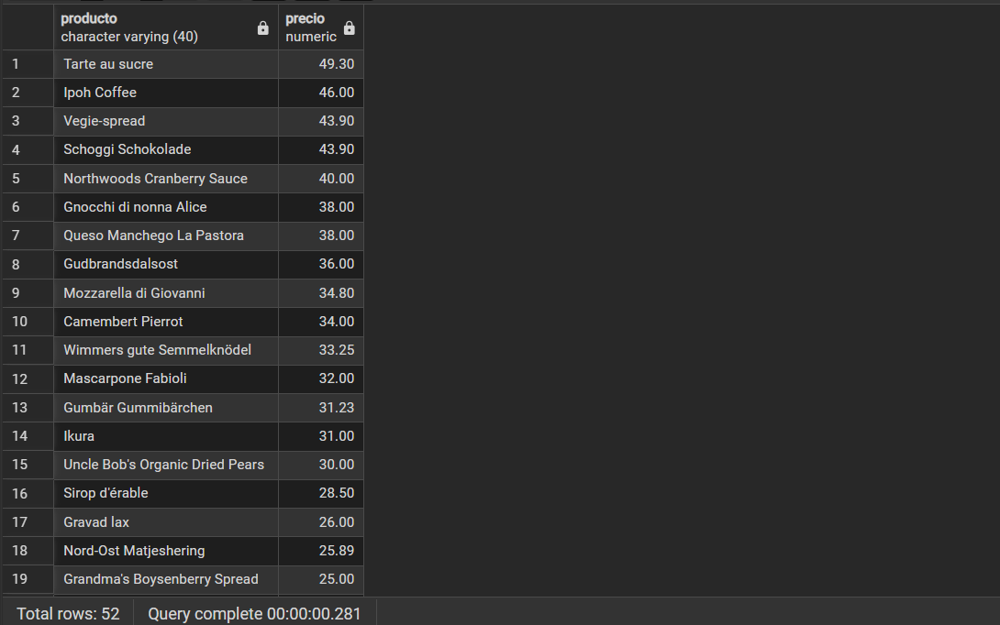

### Pregunta 1 — Catálogo comercial activo

El equipo de ventas prepara la tarifa de la próxima campaña y necesita el catálogo depurado.

Obtén los productos que **no** están descatalogados y cuyo precio unitario esté entre 10 y 50 euros, ambos incluidos. Muestra el nombre del producto y su precio redondeado a dos decimales, ordenado de mayor a menor precio.

**Columnas esperadas:** `producto`, `precio`

**Técnicas:** `WHERE`, `BETWEEN`, `ROUND()`, alias de columna, `ORDER BY`

> **Pista:** la columna `discontinued` es de tipo `integer`, no booleana. Un producto activo tiene valor 0.

```sql
-- Catálogo de productos activos con precio entre 10 y 50 euros ordenados por precio descendente
SELECT 
    product_name AS producto,
    ROUND(unit_price::numeric, 2) AS precio
FROM products
WHERE discontinued = 0
  AND unit_price BETWEEN 10 AND 50
ORDER BY unit_price DESC;

```


He filtrado por `discontinued = 0` al ser un campo numérico que identifica a los productos en catálogo activo, combinándolo con `BETWEEN 10 AND 50` para acotar el rango de precios de forma inclusiva. Apliqué un cast a numeric dentro de `ROUND()` porque en PostgreSQL `unit_price` es de tipo real y requiere dicha conversión para admitir decimales. Finalmente, ordené por el valor numérico original en sentido descendente para cumplir con la prioridad de mayor a menor precio sin alterar el alias.
