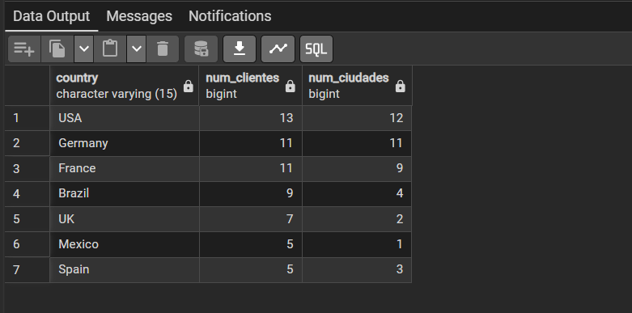

### Pregunta 1 — Catálogo comercial activo

El equipo de ventas prepara la tarifa de la próxima campaña y necesita el catálogo depurado.

Obtén los productos que **no** están descatalogados y cuyo precio unitario esté entre 10 y 50 euros, ambos incluidos. Muestra el nombre del producto y su precio redondeado a dos decimales, ordenado de mayor a menor precio.

**Columnas esperadas:** `producto`, `precio`

**Técnicas:** `WHERE`, `BETWEEN`, `ROUND()`, alias de columna, `ORDER BY`

> **Pista:** la columna `discontinued` es de tipo `integer`, no booleana. Un producto activo tiene valor 0.

```sql
-- Catálogo de productos activos con precio entre 10 y 50 euros ordenados por precio descendente
SELECT 
    product_name AS producto,
    ROUND(unit_price::numeric, 2) AS precio
FROM products
WHERE discontinued = 0
  AND unit_price BETWEEN 10 AND 50
ORDER BY unit_price DESC;

```


He filtrado por `discontinued = 0` al ser un campo numérico que identifica a los productos en catálogo activo, combinándolo con `BETWEEN 10 AND 50` para acotar el rango de precios de forma inclusiva. Apliqué un cast a numeric dentro de `ROUND()` porque en PostgreSQL `unit_price` es de tipo real y requiere dicha conversión para admitir decimales. Finalmente, ordené por el valor numérico original mediante `ORDER BY unit_price DESC` en sentido descendente para cumplir con la prioridad de mayor a menor precio sin alterar el alias.


## Pregunta 2 — Concentración geográfica de la cartera

**Enunciado:** Dirección quiere saber en qué mercados está realmente concentrada la base de clientes antes de decidir dónde abrir delegación. Cuenta cuántos clientes hay en cada país y muestra únicamente aquellos países con 5 o más clientes, ordenados de mayor a menor. Indica también cuántas ciudades distintas hay en cada uno de esos países.

**Consulta:**

```sql
SELECT country AS pais
,COUNT( customer_id) AS num_clientes,
COUNT(DISTINCT(city)) AS num_ciudades
FROM customers
GROUP BY country
HAVING COUNT((customer_id)) >= 5
ORDER BY num_clientes DESC

```
Resultado:

Comentario: por rellenar

## Pregunta 3 — Alerta de reposición
Enunciado: Logística necesita detectar qué referencias están en riesgo de rotura de stock. Localiza los productos activos cuyas unidades en stock sean inferiores o iguales a su nivel de reposición. Muestra el nombre, las unidades en stock, el nivel de reposición, las unidades ya pedidas al proveedor y una columna de texto que indique 'CRÍTICO' cuando el stock sea 0 y 'AVISO' en el resto de casos.

Consulta:

```sql
-- por rellenar
```
Resultado:

Comentario: por rellenar

## Pregunta 4 — Ficha completa de producto
Enunciado: Marketing va a rehacer el catálogo impreso y necesita cada producto con su categoría y los datos de contacto de quien lo suministra. Para los productos suministrados por empresas de Italia, Francia o España, muestra el nombre del producto, el nombre de la categoría, el nombre del proveedor, su país y su ciudad. Ordena por país y, dentro de cada país, por nombre de producto.

Consulta:

```sql
-- por rellenar
```
Resultado:

Comentario: por rellenar

## Pregunta 5 — Detalle valorizado de un pedido
Enunciado: Atención al cliente recibe una reclamación sobre el pedido 10248 y necesita reconstruir la factura línea a línea. Muestra, para ese pedido, el nombre del producto, el precio unitario aplicado, la cantidad, el descuento y el importe final de cada línea. Añade el nombre del cliente y la fecha del pedido.

Consulta:

```sql
-- por rellenar
```
Resultado:

Comentario: por rellenar

## Pregunta 6 — Ranking de categorías por facturación
Enunciado: Comité de dirección: ¿qué familias de producto sostienen realmente el negocio? Calcula la facturación total de cada categoría durante toda la historia de la compañía. Muestra el nombre de la categoría, el número de líneas de pedido que ha generado, el número de productos distintos vendidos y la facturación total. Incluye únicamente las categorías que superen los 100.000 euros de facturación, ordenadas de mayor a menor.

Consulta:

```sql
-- por rellenar
```
Resultado:

Comentario: por rellenar

## Pregunta 7 — Clientes sin actividad comercial
Enunciado: Dirección comercial sospecha que hay cuentas abiertas que nunca han llegado a comprar. Lista todos los clientes con el número de pedidos que ha realizado cada uno y la fecha de su último pedido. Los clientes sin ningún pedido deben aparecer igualmente, con un 0 en el conteo y el texto 'SIN PEDIDOS' en lugar de la fecha. Ordena de forma que los clientes inactivos aparezcan primero.

Consulta:

```sql
-- por rellenar
```
Resultado:

Comentario: por rellenar

## Pregunta 8 — Organigrama de la fuerza de ventas
Enunciado: Recursos Humanos necesita el organigrama del departamento comercial en formato tabla. Muestra cada empleado con su nombre completo, su cargo, el nombre completo de la persona a la que reporta y el cargo de esa persona. El empleado que no reporta a nadie debe aparecer también, con el texto 'DIRECCIÓN GENERAL' en el campo del responsable.

Consulta:

```sql
-- por rellenar
```
Resultado:

Comentario: por rellenar

## Pregunta 9 — Rejilla de cobertura categoría × año
Enunciado: Control de gestión quiere una rejilla completa de facturación por categoría y año, sin huecos: si una categoría no vendió nada en un año concreto, debe aparecer con un 0, no desaparecer de la tabla. Genera todas las combinaciones posibles de las 8 categorías con los 3 años del histórico (24 filas) y asocia a cada combinación su facturación. Ordena por categoría y año.

Consulta:

```sql
-- por rellenar
```
Resultado:

Comentario: por rellenar

## Pregunta 10 — Mapa de países: clientes frente a proveedores
Enunciado: Expansión internacional quiere una única tabla que muestre, para cada país en el que la compañía tiene presencia, cuántos clientes y cuántos proveedores hay. Deben aparecer los países que solo tienen clientes, los que solo tienen proveedores y los que tienen ambos.

Consulta:

```sql
-- por rellenar
```
Resultado:

Comentario: por rellenar

## Pregunta 11 — Directorio unificado de contactos
Enunciado: Sistemas va a migrar el CRM y necesita una exportación única con todos los contactos de la compañía, vengan de donde vengan. Construye una sola tabla que reúna los contactos de clientes, los de proveedores y los empleados. Cada fila debe indicar el origen ('CLIENTE', 'PROVEEDOR', 'EMPLEADO'), el nombre de la persona de contacto en mayúsculas, la organización a la que pertenece, la ciudad y el país. Para los empleados, la organización es el literal 'NORTHWIND TRADERS' y el nombre de contacto se forma concatenando nombre y apellidos. Ordena por origen y luego por país.

Consulta:

```sql
-- por rellenar
```
Resultado:

Comentario: por rellenar

## Pregunta 12 — Mercados con desequilibrio
Enunciado: Compras y Ventas mantienen una discusión recurrente: ¿en qué países vendemos sin tener proveedor local, y en cuáles coincidimos? Resuelve las dos preguntas en dos consultas independientes: a) Países donde hay clientes pero ningún proveedor. b) Países donde hay a la vez clientes y proveedores. Ordena ambos resultados alfabéticamente.

Consulta:

```sql
-- por rellenar
```
Resultado:

Comentario: por rellenar

## Pregunta 13 — Clientes que nunca han comprado pescado
Enunciado: El responsable de la categoría Seafood quiere una lista de cuentas sobre las que hacer campaña de captación. Localiza los clientes que nunca han incluido un producto de la categoría 'Seafood' en ninguno de sus pedidos. Muestra el nombre del cliente, su país y el número total de pedidos que sí ha realizado, de mayor a menor.

Consulta:

```sql
-- por rellenar
```
Resultado:

Comentario: por rellenar

## Pregunta 14 — Productos por encima de la media
Enunciado: El comité de precios quiere identificar el segmento premium del catálogo. Muestra los productos activos cuyo precio unitario supere el precio medio de todo el catálogo. Incluye en cada fila el precio del producto, el precio medio general y la diferencia entre ambos, todo redondeado a dos decimales. Ordena por diferencia descendente.

Consulta:

```sql
-- por rellenar
```
Resultado:

Comentario: por rellenar

## Pregunta 15 — Ticket medio por cliente
Enunciado: Dirección comercial quiere segmentar la cartera por valor medio de pedido, no por volumen total. Calcula, para cada cliente que haya comprado alguna vez, el número de pedidos, el importe total acumulado y el importe medio por pedido. Muestra los 15 clientes con mayor ticket medio. El cálculo tiene dos niveles: primero hay que obtener el importe de cada pedido sumando sus líneas, y solo después promediar esos importes por cliente. Promediar directamente las líneas daría un resultado distinto y equivocado.

Consulta:

```sql
-- por rellenar
```
Resultado:

Comentario: por rellenar

## Pregunta 16 — El producto más caro de cada categoría
Enunciado: El equipo de compras quiere revisar el posicionamiento de precio en cada familia. Para cada categoría, muestra el producto con el precio unitario más alto. Incluye el nombre de la categoría, el nombre del producto, su precio y el precio medio de su categoría. Resuélvelo con una subconsulta correlacionada: para cada producto, comprueba si su precio coincide con el máximo de su propia categoría.

Consulta:

```sql
-- por rellenar
```
Resultado:

Comentario: por rellenar

## Pregunta 17 — Segmentación ABC de la cartera de clientes
Enunciado: Dirección quiere clasificar a los clientes en tres tramos de valor para asignar recursos comerciales. Usando expresiones de tabla común (CTE), construye una consulta que: calcule la facturación total de cada cliente; divida los clientes en cuartiles según esa facturación; asigne una etiqueta de segmento: 'A - Estratégico' al cuartil superior, 'B - Consolidado' al segundo, 'C - Ocasional' al tercero y 'D - Marginal' al cuarto; y devuelva, por segmento, el número de clientes, la facturación total del segmento y el porcentaje que representa sobre el total de la compañía.

Consulta:

```sql
-- por rellenar
```
Resultado:

Comentario: por rellenar

## Pregunta 18 — Los tres productos más vendidos de cada categoría
Enunciado: El equipo de categoría necesita el podio de cada familia para negociar con proveedores. Para cada categoría, obtén los tres productos con mayor facturación. Muestra la categoría, la posición dentro de la categoría, el nombre del producto, las unidades vendidas y la facturación. Incluye además una columna con la posición global del producto en el conjunto de la compañía, para que se vea qué productos son líderes de su nicho pero irrelevantes en el total.

Consulta:

```sql
-- por rellenar
```
Resultado:

Comentario: por rellenar

## Pregunta 19 — Evolución mensual con acumulado y media móvil
Enunciado: Control de gestión prepara el cuadro de mando de la evolución del negocio durante 1997. Para cada mes de 1997, calcula: la facturación del mes, el total acumulado desde enero, la media móvil de los tres últimos meses (el mes actual y los dos anteriores), la facturación del mes anterior y la variación porcentual respecto al mes anterior.

Consulta:

```sql
-- por rellenar
```
Resultado:

Comentario: por rellenar

## Pregunta 20 — Cuadro de mando anual por categoría
Enunciado: Última petición, y la más ambiciosa: el informe anual que se presenta al consejo. Construye una tabla donde cada fila sea una categoría y las columnas muestren la facturación de 1996, 1997 y 1998 en columnas separadas, más el total de los tres años. Añade al final una fila de totales generales. Incluye además una columna que indique el peso de cada categoría sobre la facturación total de la compañía, y otra que muestre si la categoría creció o decreció entre 1997 y 1998.

Consulta:

```sql
-- por rellenar
```
Resultado:

Comentario: por rellenar
